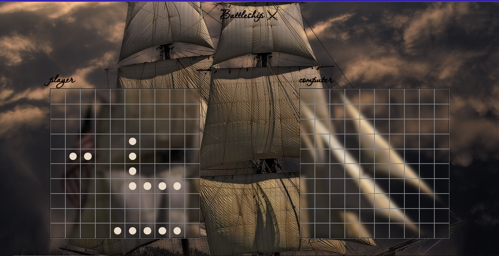

# Battleship Game

Javascript implementation of the classic battleship board game.

## [View Live](https://somtojf.github.io/Battleship/)

## Getting Started

In order to setup and work on this project on your own, you will need to:

1. Fork and Clone this project
2. Once you have cloned this project, you can install the required dependencies by using: npm install
3. A live demo of the project can be started by using: `npm start`
4. Distribution files can be produced using: `npm run build`

## How To Play

- Each player is assigned

1. A Carrier of length 5
2. A Battleship of length 4
3. A Destroyer of length 3
4. A Patrol Boat of length 2

- The Computer and the Player both take turns attacking each other's boards.
- A Player wins when all ships on the opponents board have been sunk.

## Contributions 🤝

Contributions, Issues and feature requests are very much welcome!

## Show your Support

If you got until here, show your love hitting the ⭐️ button, I'd really appreciate it.
